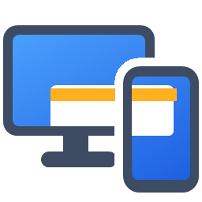

<p align="center"></p>

# CelMonitor

Use um celular Android como **monitor adicional de verdade** do Windows, pelo cabo USB.

O Windows enxerga o celular como uma tela a mais (em *Configurações > Sistema > Tela*): dá para arrastar janelas, escolher resolução e orientação, e a imagem chega com baixa latência (medido: 60 fps e ~25 ms num Xiaomi Mi Max 3 por USB direto).

## Como funciona

```
Windows ─ driver de monitor virtual (IddCx) ─ captura na GPU ─ H.264 por hardware (NVENC/AMF/QSV)
        ─ USB direto (Android Open Accessory) ou ADB ─ app Android ─ decodificador de hardware ─ tela
```

| Parte | Tecnologia |
|---|---|
| Monitor virtual | driver Indirect Display (UMDF 2 / IddCx) próprio |
| Captura e vídeo | Desktop Duplication, conversão de cor na GPU, H.264 pelo Media Foundation |
| USB | Android Open Accessory 2.0 + WinUSB (principal) e ADB (alternativa automática) |
| App Android | Kotlin, MediaCodec + SurfaceView (Android 10+) |
| App Windows | C++20 / Win32, fica na bandeja e conecta sozinho |

## Para usar

Veja **[docs/INSTALACAO.md](docs/INSTALACAO.md)**: um instalador, uma configuração no celular (Depuração USB) e pronto.

## Para desenvolver

Veja **[docs/DESENVOLVIMENTO.md](docs/DESENVOLVIMENTO.md)** (compilar, depurar, testar, adicionar codecs e tipos de entrada).

Documentos técnicos:
- [docs/ANALISE_TECNICA.md](docs/ANALISE_TECNICA.md) — por que esta arquitetura, alternativas avaliadas, dificuldades
- [docs/PROTOCOLO.md](docs/PROTOCOLO.md) — protocolo de comunicação PC ↔ celular

## Situação

| Funcionalidade | Estado |
|---|---|
| Monitor virtual, captura, H.264, app Android | pronto |
| USB direto (AOA) com volta automática para ADB | pronto |
| Paisagem/retrato, resolução, FPS, qualidade, perfis por celular | pronto |
| Instalador, bandeja, iniciar com o Windows, guia de primeiros passos | pronto |
| Touch do celular controlando o PC | próxima fase |
